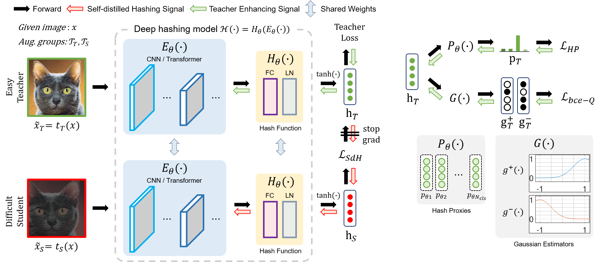

# Self-Distilled-Hashing for Deep Image Retrieval

Official Pytorch implementation of "Self-Distilled Hashing"

*This repository is anonymized for double-blind review.*

## Overall training procedure of DHD

<p align="center"></p>


## Requirements

Prepare requirements by following command.
```
pip install -r requirements.txt
```

## Train DHD models
### Prepare datasets
We use public benchmark datasets: ImageNet, NUS-WIDE, MS COCO.  
Image file name and corresponding labels are provided in ```./data```.

Example
- Train DHD model with ImageNet, AlexNet backbone, 64-bit, temperature scaling with 0.2
- ```python main_DHD.py --dataset=imagenet --encoder=AlexNet --N_bits=64 --temp=0.2``` 

```python main_DHD.py --help``` will provide detailed explanation of each argument.

### (TBD) Self-distilled hashing with other methods.
We will provide self-distilled hashing learning to improve previous deep hashing algorithms.

### Model ZOO

| Method  | Dataset | Backbone| Bits | mAP|
| ------------- | ------------- | ------------- | ------------- | ------------- |
| DHD  | ImageNet | AlexNet  | 16 | 0.657 |
| DHD  | ImageNet | AlexNet  | 32 | 0.701 |
| DHD  | ImageNet | AlexNet  | 64 | 0.701 |
| DHD  | ImageNet | AlexNet  | 16 | 0.701 |
| DHD  | ImageNet | AlexNet  | 32 | 0.701 |
| DHD  | ImageNet | AlexNet  | 64 | 0.701 |

