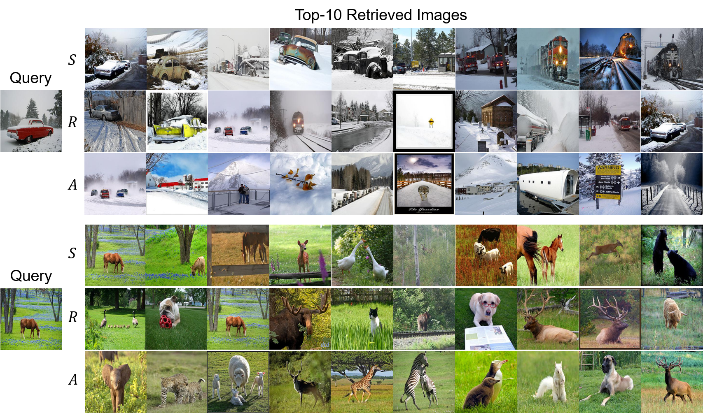

# Deep Hash Distillation for Image Retrieval (Cont'd)

Official Pytorch implementation of "Deep Hash Distillation for Image Retrieval" Accepted to ECCV2022

## Overall training procedure of DHD

<p align="center"></p>


## Requirements

Prepare requirements by following command.
```
pip install -r requirements.txt
```

## Train DHD models
### Prepare datasets
We use public benchmark datasets: ImageNet, NUS-WIDE, MS COCO.  
Image file name and corresponding labels are provided in ```./data```.

<a href="https://drive.google.com/file/d/1TAjFKnOEse4xU_ScZOM8NgQLGexebmRn/view?usp=share_link">NUS-WIDE</a>

<a href="https://drive.google.com/file/d/1EsRZP3YsLbkbJ9rNXA4x5BFkHVFIGlQP/view?usp=share_link">MS COCO</a>

Example
- Train DHD model with ImageNet, AlexNet backbone, 64-bit, temperature scaling with 0.2
- ```python main_DHD.py --dataset=imagenet --encoder=AlexNet --N_bits=64 --temp=0.2``` 

```python main_DHD.py --help``` will provide detailed explanation of each argument.

## Retrieval Results with Different Backbone
S: Swin Transformer, R: ResNet, A: AlexNet

ImageNet
<p align="center"></p>
NUS-WIDE
<p align="center"></p>
MS COCO
<p align="center"></p>


